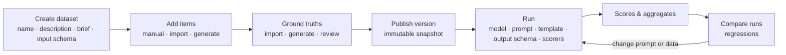
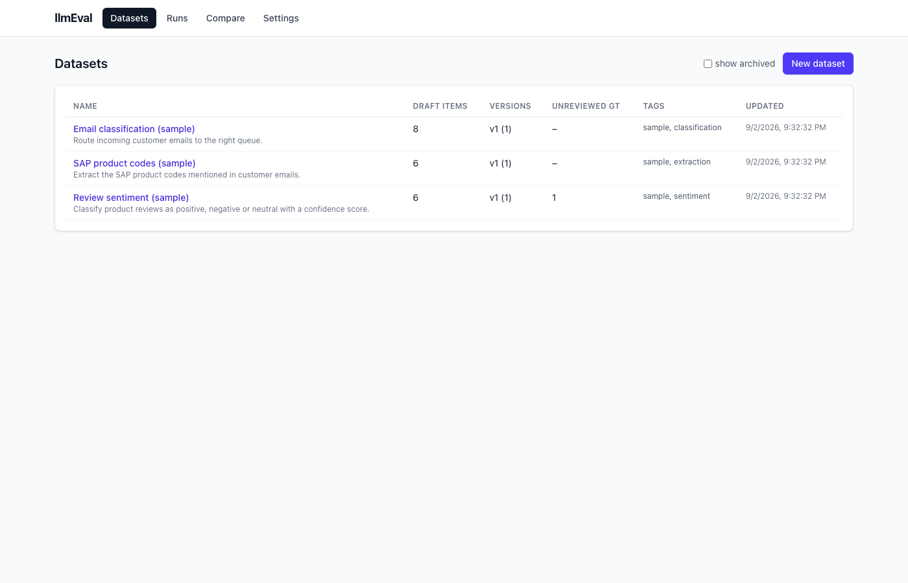
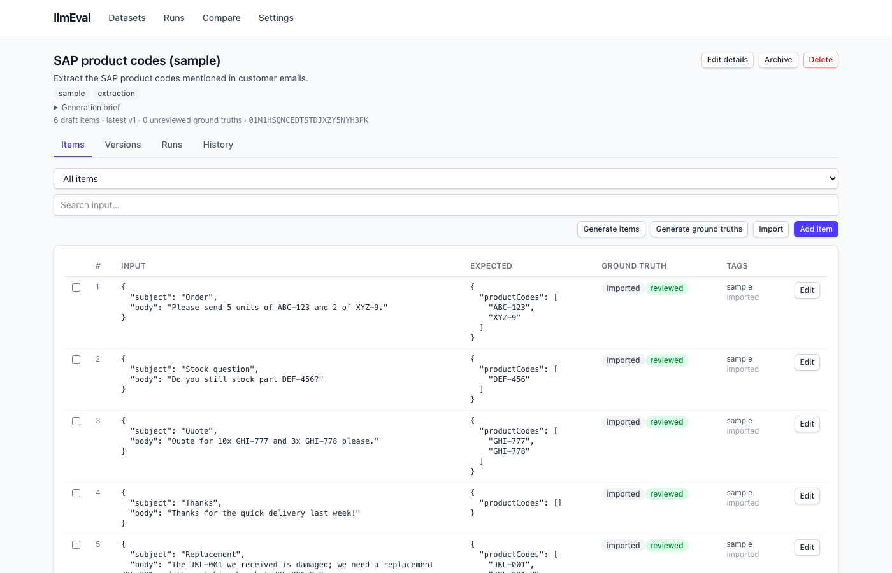
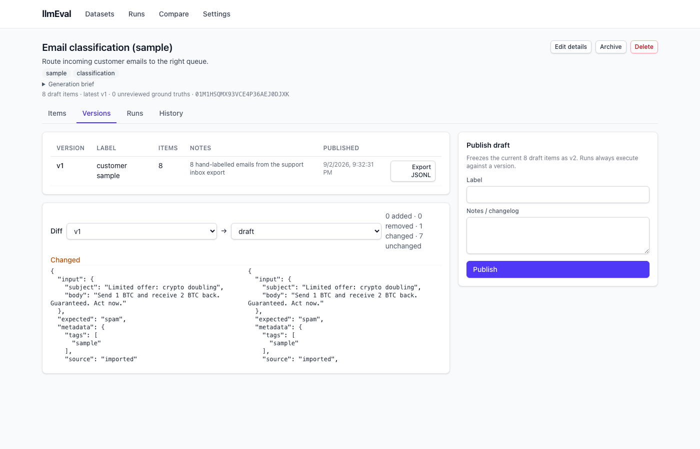
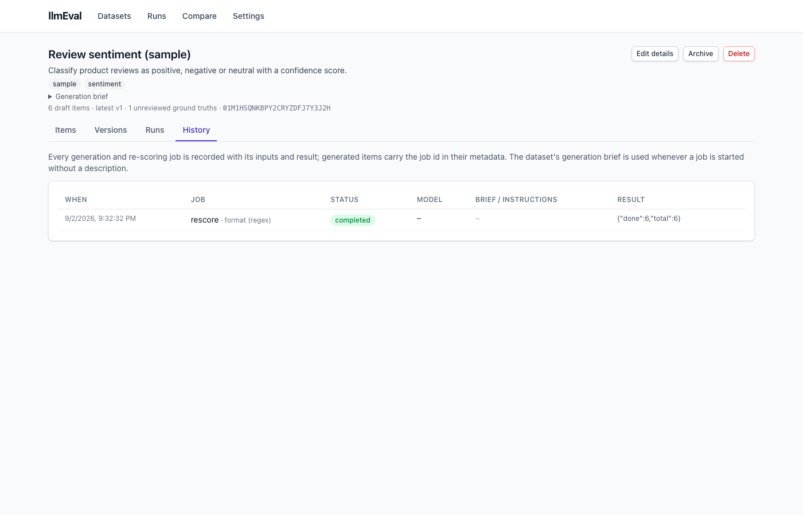
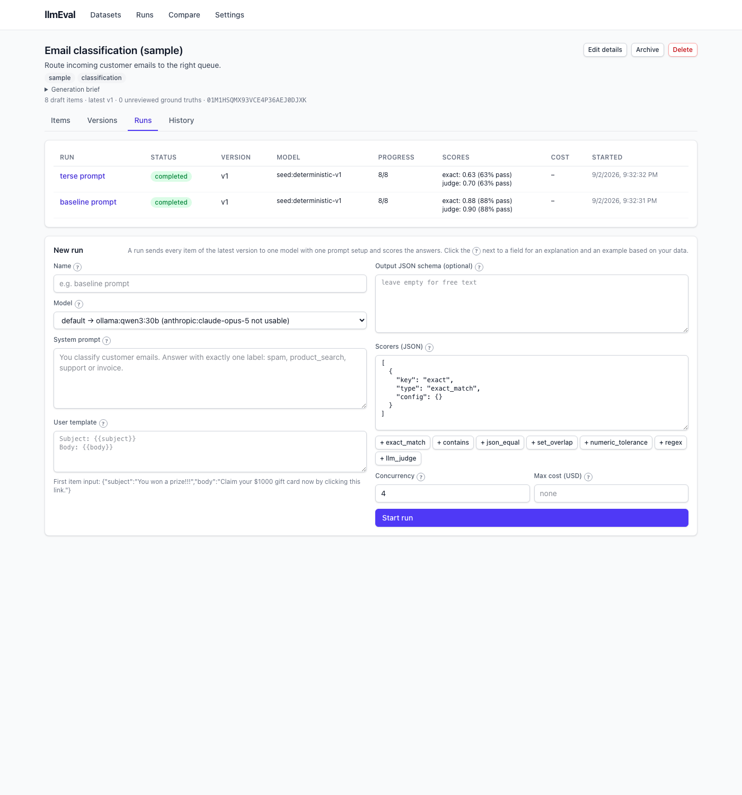
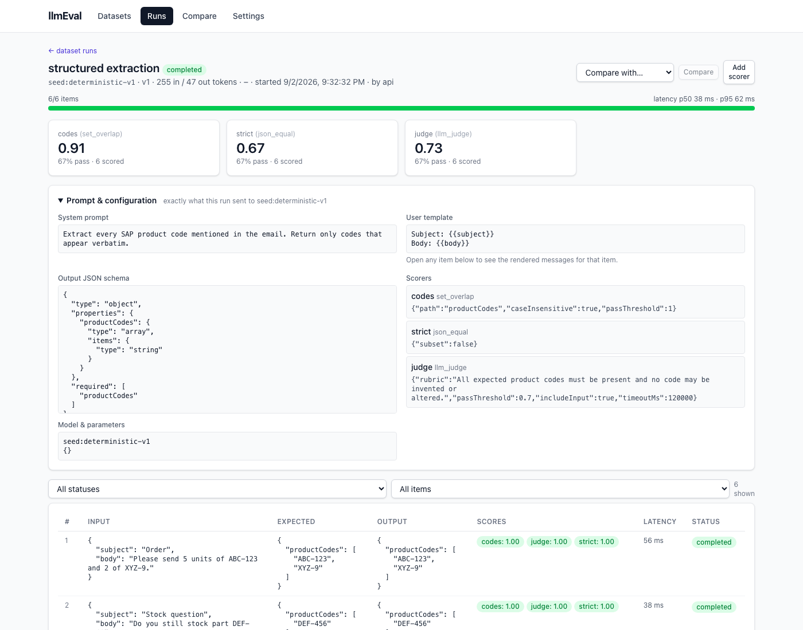
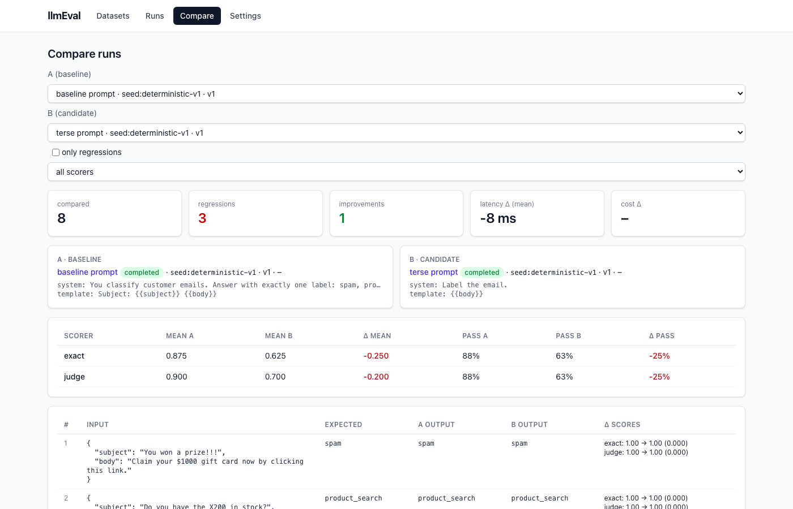
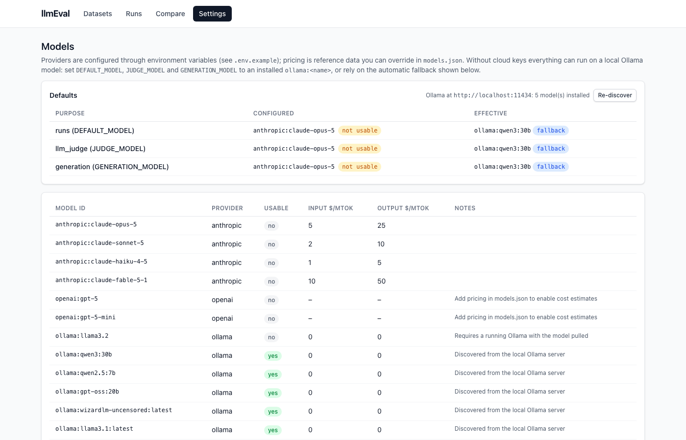

# llmEval manual

This manual explains how to build evaluation datasets and how scoring works. It assumes the
server is running (`pnpm build && pnpm dev`, web UI at <http://localhost:3000>). Everything shown
in the web UI can also be done from Claude Code through the MCP tools; the tool names are given
alongside each step. The screenshots come from the sample data that `pnpm seed` creates, so you
can reproduce every screen locally.

Contents

1. [The workflow in one picture](#1-the-workflow-in-one-picture)
2. [Getting started](#2-getting-started)
3. [Creating a dataset](#3-creating-a-dataset)
4. [Running a dataset against a model](#4-running-a-dataset-against-a-model)
5. [Scoring](#5-scoring)
6. [Comparing runs](#6-comparing-runs)
7. [Models and settings](#7-models-and-settings)
8. [Driving it from Claude Code](#8-driving-it-from-claude-code)
9. [Sample data](#9-sample-data)
10. [Troubleshooting](#10-troubleshooting)

---

## 1. The workflow in one picture



- A **dataset** holds **items**: `{ input, expected, metadata }`. `input` is what the model sees, `expected`
  is the ground truth, `metadata` carries tags and provenance.
- A dataset has an editable **draft** and immutable **versions**. Runs always execute a version, so a
  result can always be traced back to exactly which items and ground truths it used.
- A **run** executes one version against one model with one prompt configuration and a list of
  **scorers**. Every item gets an output plus one **score per scorer**; the run gets aggregates.
- **Compare** puts two runs side by side and flags regressions.

## 2. Getting started

```bash
pnpm install
cp .env.example .env        # add ANTHROPIC_API_KEY / OPENAI_API_KEY, or run Ollama locally
pnpm build                  # builds the web app once
pnpm seed                   # optional: sample datasets, runs and scores
pnpm dev                    # http://localhost:3000  (API, MCP at /mcp, web UI)
```

No cloud key is required: installed Ollama models are discovered at startup and used as the default
when the configured default model is not usable (see [Models and settings](#7-models-and-settings)).



## 3. Creating a dataset

### 3.1 Dataset details

Datasets → **New dataset**. Fill in:

| Field                                             | Purpose                                                                                                                                                                                                                                       |
| ------------------------------------------------- | --------------------------------------------------------------------------------------------------------------------------------------------------------------------------------------------------------------------------------------------- |
| **Name**                                          | Shown everywhere; keep it short (`sap-product-codes`).                                                                                                                                                                                        |
| **Description**                                   | What the dataset evaluates. Shown on the dataset page and used by the `write_rubric` prompt.                                                                                                                                                  |
| **Generation brief** (optional)                   | A paragraph describing the task and what inputs look like. Reused automatically as the description for synthetic item generation and as the instructions for ground-truth generation, so you write it once. Templates and seeds fill this in. |
| **Input schema** (optional, MCP/API only for now) | A JSON Schema for `input` objects. Makes generated items structurally consistent.                                                                                                                                                             |

All of these can be changed later with **Edit details** on the dataset page.

MCP: `create_dataset({ name, description, generationBrief, inputSchema })`, `update_dataset`.

### 3.2 Items: the shape of `input` and `expected`

`input` can be one of three shapes; pick the one that matches your application:

| Shape             | Example                                                                                                                       | How it reaches the model                                                                                                                                          |
| ----------------- | ----------------------------------------------------------------------------------------------------------------------------- | ----------------------------------------------------------------------------------------------------------------------------------------------------------------- |
| **String**        | `"What is the capital of France?"`                                                                                            | Sent as the user message, or substituted for `{{input}}` in the user template.                                                                                    |
| **Object**        | `{ "subject": "Order", "body": "Please send 5 units of ABC-123" }`                                                            | Fields are substituted into the user template with `{{subject}}`, `{{body}}`, `{{nested.path}}`, `{{json field}}`. Without a template the object is sent as JSON. |
| **Chat messages** | `[{ "role": "user", "content": "Hi" }, { "role": "assistant", "content": "Hello" }, { "role": "user", "content": "Ports?" }]` | Sent as-is (system prompt prepended). Use it to evaluate the next turn of a conversation.                                                                         |

`expected` is any JSON value and should mirror what you will ask the model to produce:

- A **string** for free text or a label: `"spam"`.
- An **object** when you run with an output schema: `{ "productCodes": ["ABC-123", "XYZ-9"] }`.
- An **array of alternatives** when several answers are acceptable: `["Paris", "paris, France"]`. The
  `exact_match` and `contains` scorers treat an array as "any of these".
- **Nothing**: items without a ground truth can still be run; scorers that need one will score 0.
  Use _Generate ground truths_ or import them later.



Each item shows where its ground truth came from (`imported`, `human`, `generated`) and whether it
is **reviewed**. Generated truths start unreviewed; approve them with the checkbox selection →
**Approve**, or edit them (editing marks a truth as human-provided).

MCP: `add_items`, `list_items(filter=missing_expected|unreviewed)`, `update_item`, `review_items`, `delete_items`.

### 3.3 Adding items by hand

**Add item** on the Items tab. Paste text or JSON in _Input_ and _Expected_; JSON is detected
automatically (`{`, `[`, `"`, numbers, `true/false/null`), everything else is kept as text.

### 3.4 Importing a spreadsheet or file

**Import** accepts JSON, JSONL, CSV and XLSX. For CSV/XLSX you map columns:

| Mapping field     | Meaning                                                           | Example          |
| ----------------- | ----------------------------------------------------------------- | ---------------- |
| Input column(s)   | One column → string input; several → object input with those keys | `Subject, Body`  |
| Expected column   | The ground truth column                                           | `Codes`          |
| Split expected on | Turns `"ABC-123, XYZ-9"` into `["ABC-123", "XYZ-9"]`              | `,`              |
| Sheet (xlsx)      | Worksheet name, default first sheet                               | `Mails`          |
| Tags              | Added to every imported item                                      | `customer-sheet` |

Always click **Preview (dry run)** first: it shows the detected columns, the first rows as they
would be stored and per-row errors, without writing anything. Duplicate inputs (case- and
whitespace-insensitive) are skipped, so re-importing an updated sheet only adds new rows.

JSON/JSONL rows may be `{ "input": ..., "expected": ..., "tags": "a, b" }`; a row without an `input`
key is treated as the input itself (minus `expected`).

MCP: `import_items({ datasetId, format, path | content, mapping, dryRun })` — from Claude Code pass a
file `path`, no need to read the file yourself.

### 3.5 Generating items synthetically

**Generate items** asks a model for new, diverse inputs (and, optionally, drafted ground truths).
The description defaults to the dataset's generation brief; selected items are used as few-shot
examples; the dataset's input schema constrains the shape. Duplicates of existing items are dropped.
Generated items get `metadata.source = "synthetic"` and the job id, and drafted truths are marked
**generated / unreviewed**.

MCP: `generate_items({ datasetId, description?, count, seedItemIds?, inputSchema?, withExpected })` → `get_job`.

### 3.6 Generating and reviewing ground truths

**Generate ground truths** drafts `expected` for items that have none (or for selected items with
_overwrite_). Give precise instructions (default: the generation brief); for structured answers
provide a JSON schema so `expected` matches your output schema. Review the result with the
**Unreviewed ground truth** filter, then **Approve** or **Edit**. Publishing warns while unreviewed
truths remain.

MCP: `generate_ground_truths`, `list_items(filter="unreviewed")`, `review_items`.

### 3.7 Versions

The **Versions** tab freezes the draft into `v1`, `v2`, …. Publishing is refused when nothing changed.
The diff selector shows what changed between two versions or between a version and the draft.
**Export JSONL** downloads a version. Runs started while the draft has unpublished changes publish a
new version automatically.



MCP: `publish_version`, `list_versions`, `diff_versions`, `export_version`.

### 3.8 History

The **History** tab lists every generation and re-scoring job with its text, model, status and
result. **Reuse** reopens the dialog prefilled with that job's description or instructions.



MCP: `list_jobs({ datasetId })`.

## 4. Running a dataset against a model

Runs tab → **New run**:

| Field                  | Notes                                                                                                                           |
| ---------------------- | ------------------------------------------------------------------------------------------------------------------------------- |
| Model                  | `provider:model`; the default shows which model will actually be used, including a local fallback.                              |
| System prompt          | Task instructions. May use `{{field}}` placeholders too.                                                                        |
| User template          | Rendered per item: `Subject: {{subject}}\n\n{{body}}`, or `{{input}}` for string inputs. Empty = input as-is.                   |
| Output JSON schema     | When set, the model is forced to return a matching object and `output` is that object. Use it whenever `expected` is an object. |
| Scorers                | JSON list of `{ key, type, config }`, see [Scoring](#5-scoring).                                                                |
| Concurrency / Max cost | Parallel items; abort when the estimated cost exceeds the cap.                                                                  |



The run page shows live progress, per-scorer aggregate cards, and every item with input, expected,
output, scores, latency and status. Click a row for the exact messages sent, the raw provider
metadata and each score's rationale.



MCP: `start_run` → `get_run` (poll until `completed`) → `list_run_items({ scorerKey })` → `get_run_item`.

## 5. Scoring

A **scorer** turns `(input, expected, output)` into `score ∈ [0, 1]`, an optional `passed` flag,
and optional `rationale`/`details`. Scorers are attached to a run as a list of specs:

```json
[
  {
    "key": "codes",
    "type": "set_overlap",
    "config": { "path": "productCodes", "passThreshold": 1 }
  },
  { "key": "strict", "type": "json_equal", "config": {} },
  {
    "key": "judge",
    "type": "llm_judge",
    "config": { "rubric": "All expected codes present, none invented." }
  }
]
```

- `key` is your name for the scorer within the run (it appears in tables and filters); `type`
  selects the scorer; `config` is validated against the scorer's schema (see Settings → Scorers or
  `list_scorers`).
- Scoring happens **inline** while the run executes, so the run page fills in live.
- A finished run can get **additional scorers** later with **Add scorer** (MCP `score_run`): the
  model is not called again (except by `llm_judge`).
- Aggregates per scorer: mean score, pass rate (when the scorer reports pass/fail), number scored,
  number of scorer errors.

### 5.1 Which scorer for which answer

| Your `expected` looks like                                                   | Use                                     | Because                                                                      |
| ---------------------------------------------------------------------------- | --------------------------------------- | ---------------------------------------------------------------------------- |
| A short label or exact string (`"spam"`)                                     | `exact_match` (`caseInsensitive: true`) | Only an exact answer counts.                                                 |
| Free text that must mention something (`"refund within 14 days"`)            | `contains`                              | Wording may vary but the fact must be present.                               |
| A format to enforce (`^\d{4}-\d{2}-\d{2}$`) or a value to extract from prose | `regex`                                 | Validates shape, or compares a captured group to `expected`.                 |
| A structured object (`{ "sentiment": "neutral", "score": 0.7 }`)             | `json_equal` (whole object or `path`)   | Structural equality, key order ignored; `subset: true` tolerates extra keys. |
| A number possibly embedded in text (`"42 EUR"`)                              | `numeric_tolerance`                     | Within `abs`/`rel` tolerance.                                                |
| A list where order does not matter (`["ABC-123", "XYZ-9"]`)                  | `set_overlap`                           | Precision / recall / F1, tells you what was missing or invented.             |
| Anything needing judgement (summaries, explanations, partial credit)         | `llm_judge`                             | A grader model applies your rubric and explains its verdict.                 |

Combine them: a strict scorer for the headline number plus a judge for nuance is the usual pair.

### 5.2 `exact_match`

Pass when the output equals the expected text after normalisation.

| Config            | Default | Meaning                                             |
| ----------------- | ------- | --------------------------------------------------- |
| `caseInsensitive` | `false` | Compare case-insensitively.                         |
| `trim`            | `true`  | Trim and collapse whitespace.                       |
| `path`            | –       | Dot path into output and expected, e.g. `"answer"`. |

Needs: `expected` as a string (or an array of acceptable strings). Non-strings are compared as JSON.

```text
expected: "invoice"        output: "Invoice"      config: { caseInsensitive: true }  → score 1, pass
expected: ["Paris", "paris, France"]   output: "paris, France"                  → score 1, pass
expected: "support"        output: "Support ticket"                             → score 0, fail
```

### 5.3 `contains`

Pass when the output contains the needle (default: the expected text, any of an array).

| Config                            | Default  | Meaning                         |
| --------------------------------- | -------- | ------------------------------- |
| `needle`                          | expected | Explicit text that must appear. |
| `caseInsensitive`, `trim`, `path` | as above |                                 |

```text
expected: "ABC-1"   output: "Codes found: ABC-1, DEF"                           → 1
needle: "refund"    output: "You can get a Refund within 14 days" (caseInsensitive) → 1
```

### 5.4 `regex`

Pass when `pattern` matches the output; with `compareGroup` the captured group must equal `expected`.

| Config                    | Default  | Meaning                                                   |
| ------------------------- | -------- | --------------------------------------------------------- |
| `pattern`                 | required | JavaScript regular expression source.                     |
| `flags`                   | `""`     | e.g. `"i"`.                                               |
| `compareGroup`            | –        | Group index (0 = whole match) to compare with `expected`. |
| `caseInsensitive`, `path` |          |                                                           |

```text
pattern: "^(positive|negative|neutral)$"  path: "sentiment"   → format check on a field
pattern: "Total: (\\d+)"  compareGroup: 1   expected: "42"  output: "Total: 42 EUR" → 1
```

### 5.5 `json_equal`

Pass when output and expected are structurally equal (key order ignored).

| Config   | Default | Meaning                                                                 |
| -------- | ------- | ----------------------------------------------------------------------- |
| `path`   | –       | Compare a sub-field of both, e.g. `"sentiment"`.                        |
| `subset` | `false` | Pass when expected is a deep subset of the output (extra keys allowed). |

Needs: run with an **output schema** so `output` is an object, and `expected` shaped the same way.

```text
expected: { "a": 1, "b": [1, 2] }   output: { "b": [1, 2], "a": 1 }            → 1
expected: { "a": 1 }                output: { "a": 1, "extra": true }          → 0   (subset: true → 1)
```

### 5.6 `numeric_tolerance`

Pass when the numeric output is within tolerance of the expected number. Numbers inside strings are
parsed (`"Total: 42 EUR"` → 42).

| Config | Default | Meaning                                       |
| ------ | ------- | --------------------------------------------- |
| `abs`  | `0`     | Absolute tolerance.                           |
| `rel`  | `0`     | Relative tolerance as a fraction of expected. |
| `path` | –       | Field to read on both sides.                  |

```text
expected: 100  output: "The answer is 101"  abs: 1        → 1
expected: 100  output: 104                  rel: 0.05     → 1;   output: 106 → 0
```

### 5.7 `set_overlap`

Treats output and expected as sets of strings and scores **F1**; `details` hold precision, recall,
`missing` (expected but absent) and `extra` (present but not expected). This is the right scorer for
lists of codes, tags, entities or ids, because one missing code lowers the score instead of zeroing it.

| Config            | Default | Meaning                                             |
| ----------------- | ------- | --------------------------------------------------- |
| `path`            | –       | Field holding the list, e.g. `"productCodes"`.      |
| `caseInsensitive` | `true`  | Normalise case.                                     |
| `split`           | –       | Delimiter to turn a string into a list, e.g. `","`. |
| `passThreshold`   | `1`     | Pass when F1 ≥ threshold.                           |

```text
expected: ["ABC-123", "XYZ-9"]   output: ["ABC-123"]          → score 0.667, fail, missing ["xyz-9"]
expected: ["ABC-123"]            output: ["ABC-123", "FAKE-1"] → score 0.667, fail, extra ["fake-1"]
expected: []                     output: []                    → score 1
```

### 5.8 `llm_judge`

Asks a grader model to compare the candidate output with the expected answer following your rubric
and returns `{ score, pass, rationale }`. The judge's tokens and cost are recorded on the score and
included in the run cost. It costs one extra model call per item.

| Config          | Default                     | Meaning                                                                                              |
| --------------- | --------------------------- | ---------------------------------------------------------------------------------------------------- |
| `rubric`        | generic correctness rubric  | Grading instructions: what must be present, what is penalised. Write it as imperative bullet points. |
| `passThreshold` | `0.7`                       | Pass when score ≥ threshold (the judge's own `pass` wins when given).                                |
| `model`         | `JUDGE_MODEL` (or fallback) | `provider:model` for the judge; use a strong model, ideally not the one under test.                  |
| `includeInput`  | `true`                      | Show the original input to the judge.                                                                |

Needs: an `expected` value (without one the judge grades on the rubric alone) and a clear rubric.
Example rubric for the product-code task:

```text
- Every expected product code must appear in the output; a missing code caps the score at 0.5.
- Codes that do not appear in the email are hallucinations; any hallucinated code scores 0.
- Case and ordering differences are fine.
```

The `write_rubric` MCP prompt drafts a rubric from a dataset's items. Judge rationales are shown in
the item drawer and in `llmeval://runs/{id}/failures`.

### 5.9 Reading scores

- **Item scores** are badges per scorer key; green = passed, amber = failed, red = scorer error
  (e.g. an invalid regex). Hover for the rationale.
- **Failed scorer filter** on the run page lists only the items that failed a given scorer; from MCP,
  `list_run_items({ runId, scorerKey })`.
- A scorer error never fails the run; it is counted in the scorer's `errorCount`.

## 6. Comparing runs

Open a run → **Compare with…** → pick another run of the same dataset (or Compare in the top
navigation). You get per-scorer aggregate deltas, latency and cost deltas, and every item side by
side with its score deltas. Rows are highlighted red for regressions and green for improvements;
**only regressions** hides the rest. Runs on different versions can be compared: items that exist on
one side only are counted.



MCP: `compare_runs({ a, b, onlyRegressions, scorerKey })`; the `triage_run` prompt walks through a
failure analysis and proposes fixes.

## 7. Models and settings

Settings lists the model registry, which providers are configured, reference pricing, and the
**effective default** for runs, the judge and generation. When a configured default's provider has no
key, llmEval falls back to the first usable model (installed Ollama models first) and marks it as a
fallback. **Re-discover** re-reads the Ollama model list.



Prices are reference data; override or add models in `models.json` (see `models.example.json`).
Unknown pricing yields a `–` cost rather than a guess.

## 8. Driving it from Claude Code

```bash
claude mcp add --transport http llmeval http://localhost:3000/mcp
```

Then, for example:

> Using llmeval: create a dataset "sap-product-codes" with a generation brief for extracting SAP
> product codes from emails, import `~/Downloads/samples.xlsx` mapping Subject+Body to the input
> and Codes (split on ",") to expected, publish it, run it on the default model with `set_overlap`
> on `productCodes` and an `llm_judge`, and show me the items that failed.

Claude will call `create_dataset` → `import_items(dryRun)` → `import_items` → `publish_version` →
`start_run` → `get_run` → `list_run_items({ scorerKey })`. The MCP server also exposes resources
(`llmeval://datasets/{id}`, `llmeval://runs/{id}/failures`, …) and prompts (`build_eval`,
`triage_run`, `write_rubric`).

## 9. Sample data

`pnpm seed` inserts three datasets tagged `sample` with ground truths, a published version each,
four completed runs and one re-scoring job. Runs are executed by a deterministic stand-in model
(`seed:deterministic-v1`), so the data is identical every time and no provider is needed.

| Dataset              | Shows                                                                                                                                                                        |
| -------------------- | ---------------------------------------------------------------------------------------------------------------------------------------------------------------------------- |
| Email classification | Label task; two runs (baseline vs terse prompt) with `exact_match` + `llm_judge`; compare shows 3 regressions and 1 improvement; a pending draft change on the Versions tab. |
| SAP product codes    | Structured output with `set_overlap`, `json_equal`, `llm_judge`; items with a missing and an invented code.                                                                  |
| Review sentiment     | Object answers with `json_equal(path)`, `numeric_tolerance`, a `regex` scorer added afterwards (History tab), one unreviewed generated truth and one item without a truth.   |

`pnpm seed --reset` deletes the sample datasets and re-creates them; `--db PATH` targets another
database file.

## 10. Troubleshooting

| Symptom                                            | Fix                                                                                                                                                                                                                                                                                |
| -------------------------------------------------- | ---------------------------------------------------------------------------------------------------------------------------------------------------------------------------------------------------------------------------------------------------------------------------------- |
| `… is not usable: ANTHROPIC_API_KEY is not set`    | Add the key to `.env`, pass an available model explicitly, or rely on the Ollama fallback shown in Settings.                                                                                                                                                                       |
| `model is not installed in Ollama (ollama pull …)` | Pull the model, then **Re-discover** in Settings or `list_models(refresh=true)`.                                                                                                                                                                                                   |
| Run stays `running` after a restart                | Runs resume automatically on boot (`AUTO_RESUME=true`); otherwise they are marked `interrupted` and can be resumed from the run page.                                                                                                                                              |
| Items end up `failed` with "Timed out after … ms"  | The model did not answer within `params.timeoutMs` (default `ITEM_TIMEOUT_MS`, 5 min). On local Ollama models several parallel requests slow each other down: use concurrency 1 (the default for `ollama:` models) or raise the timeout. Resume the run to retry the failed items. |
| Scores show red `err` badges                       | Open the item drawer for the scorer error (invalid regex, wrong `path`); fix the config and **Add scorer** with `overwrite`.                                                                                                                                                       |
| A server is still running from an earlier session  | `scripts/dev.sh status`, then `scripts/dev.sh stop` or `scripts/dev.sh kill-all`.                                                                                                                                                                                                  |
